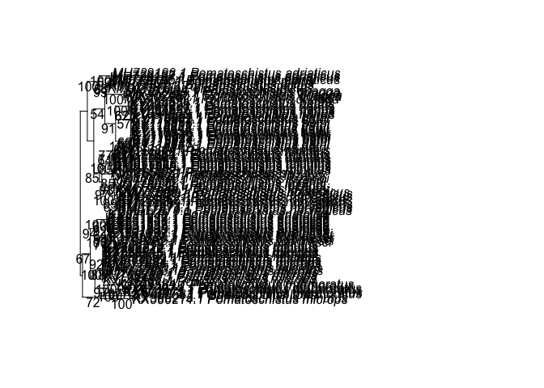

<!-- README.md is generated from README.Rmd. Please edit that file -->

# fishphylo

<!-- badges: start -->

<!-- badges: end -->

The goal of fishphylo is to import sequence data from GenBank and from
Fasta files and build basic phylogenetic trees.

## Installation

You can install the development version from
[GitHub](https://github.com/) with:

``` r
# install.packages("devtools")
devtools::install_github("jurenoult/fishphylo")
#> Using github PAT from envvar GITHUB_PAT
#> Skipping install of 'fishphylo' from a github remote, the SHA1 (9cb463cc) has not changed since last install.
#>   Use `force = TRUE` to force installation
```

# Use

## import sequences from GenBank and export a .fasta file

Load this project as a library.

``` r
library(fishphylo)
```

You will need to install the package msa that is available on
Bioconductor. You can install it using the following commands:

``` r
if (!requireNamespace("BiocManager", quietly=TRUE))
install.packages("BiocManager")
BiocManager::install("msa")
#> Bioconductor version 3.12 (BiocManager 1.30.10), R 4.0.3 (2020-10-10)
#> Installing package(s) 'msa'
#> 
#> The downloaded binary packages are in
#>  /var/folders/w5/jhktndf97sb8mxkgwmcbjy400000gq/T//RtmpSfg9Uw/downloaded_packages
library(msa)
```

Now, specify the names of taxa and the gene for which you want to
download DNA sequences from Genebank

``` r
ls_tax_gen <- cb_taxa_gene(c("Pomatoschistus lozanoi","Pomatoschistus adriaticus"),"COI")
#> ""
ls_tax_gen
#> [1] "(Pomatoschistus lozanoi [Organism] OR Pomatoschistus adriaticus [Organism]) AND COI[Gene]"
```

Write a fasta file with the sequences.

``` r
ls_fasta <- build_fasta(ls_tax_gen)
write_fasta(ls_fasta,"pomlozANDpomadri_COI_seqs.fasta")
```

The file has been saved in [:file\_folder: data](/analysis/data).

## Combine sequences from two fasta files

Read a fasta file generated by write\_fasta function (from GenBank),
display accession numbers and species name, keep only accessions
specified by a vector of indices:

``` r
fas1 <- read_fasta("pomlozANDpomadri_COI_seqs.fasta")
disp_access(fas1) # display accession numbers and species name
#>  1: MH729197.1 Pomatoschistus adriaticus
#>  2: MH729196.1 Pomatoschistus adriaticus
#>  3: MH729195.1 Pomatoschistus adriaticus
#>  4: MH729194.1 Pomatoschistus adriaticus
#>  5: KM077849.1 Pomatoschistus lozanoi
#>  6: KM077848.1 Pomatoschistus lozanoi
#>  7: KM077847.1 Pomatoschistus lozanoi
#>  8: JQ775033.1 Pomatoschistus lozanoi
#>  9: JQ775032.1 Pomatoschistus lozanoi
#>  10: JQ775031.1 Pomatoschistus lozanoi
#>  11: JQ775030.1 Pomatoschistus lozanoi
#>  12: JQ775029.1 Pomatoschistus lozanoi
keep <- c(1:4,9) # selection accessions 1 to 4 and accession 9
fas1 <- fas1[keep] # create a fasta object with only the selection accessions
```

Read a fasta file located in the data folder (e.g., sequences sent by
Laure) and combine the accessions with those of the first fasta

``` r
fas2 <- read_fasta("20201104_COI_fish.fasta")
fas <- c(fas1,fas2)
write_fasta(ls_fasta,"combined_seq.fasta") # it is necessary to write the new list of accessions in a fasta file
```

## Build a simple NJ phylogenetic tree

First, we need to align the sequences. This function works only from a
fasta file located in [:file\_folder: data](/analysis/data)

``` r
fas <- align_fasta("combined_seq.fasta")
#> use default substitution matrix
```

Plot a NJ tree based on JC69 distance matrix, with bootstraps

``` r
NJ_tree <- build_MLtree(fas,"example.tre")
#> negative edges length changed to 0!
#> Warning in if (!is.na(tmp)) {: la condition a une longueur > 1 et seul le premier
#> élément est utilisé
#> Warning in if (tmp == 1) {: la condition a une longueur > 1 et seul le premier
#> élément est utilisé
#> Warning in if (tmp == 2) do_rearr <- extras$rearrangement %in% c("NNI", : la
#> condition a une longueur > 1 et seul le premier élément est utilisé
```



``` r
#plot_tree(NJ_tree)
```
